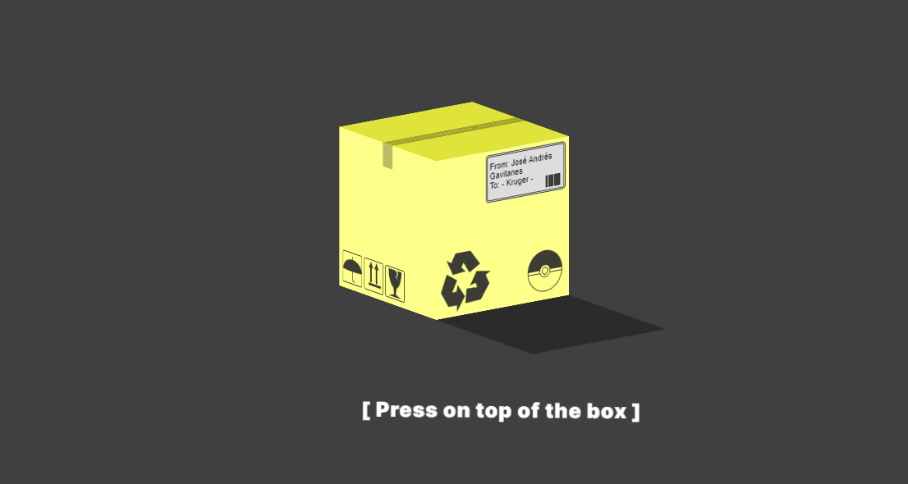
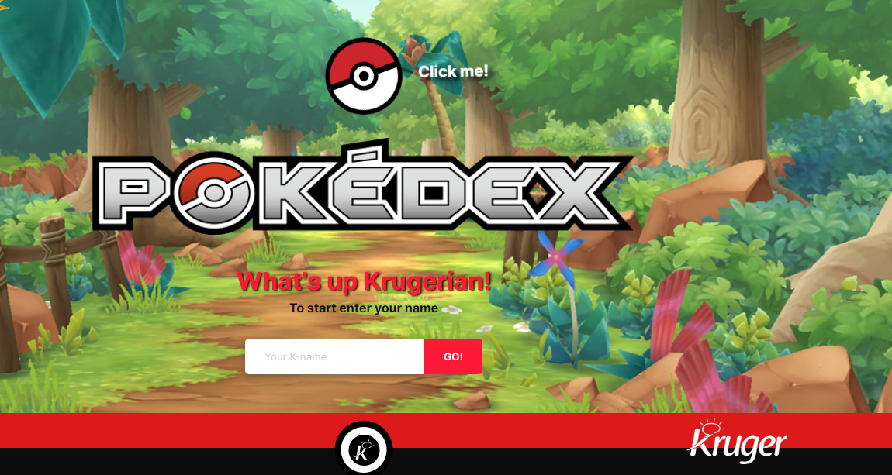
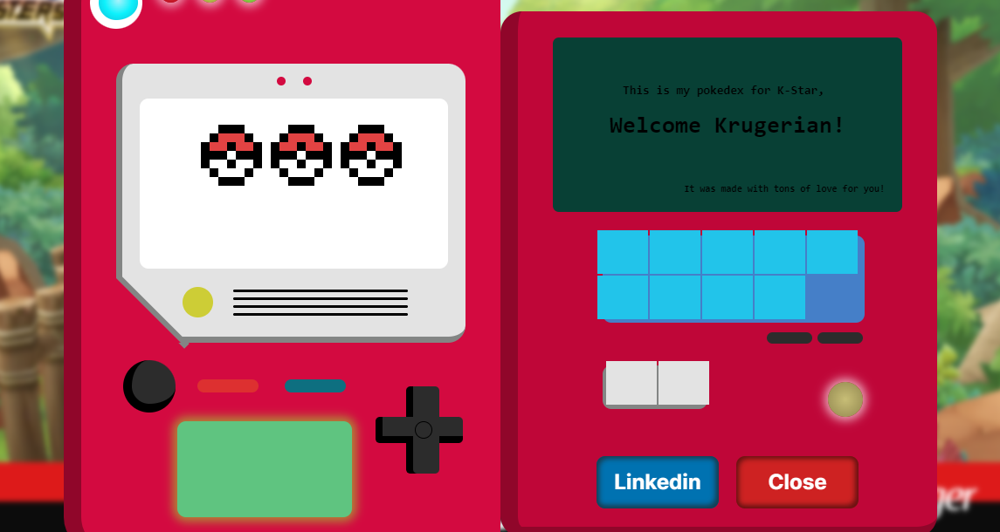
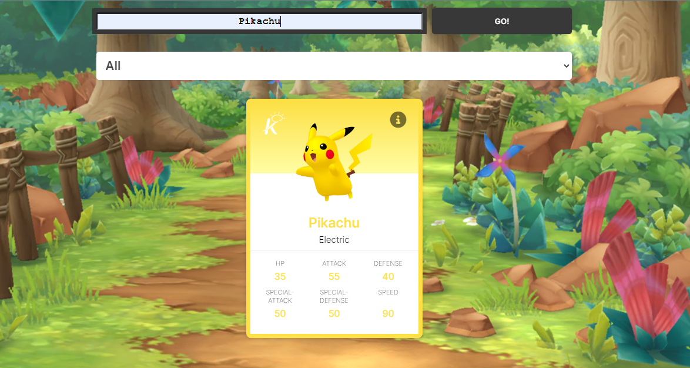
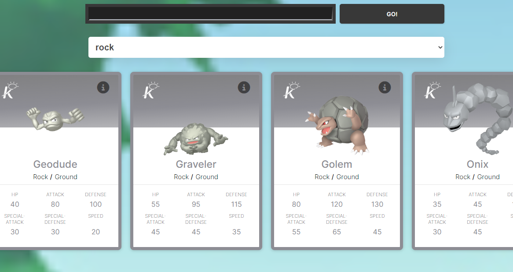
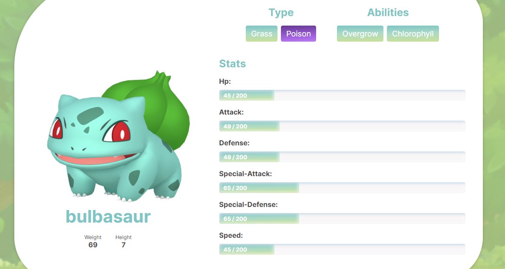

<div align="center">
  
</div>

<h3 align="center">
    Code challenge based on the famous Pokémon anime! With ReactJs, Javascript, Redux, SASS, Axios and ViteJS 💻🚀
</h3>

<p align="center">
  <a href="#about-the-project">About The Project</a> |
  <a href="#layout">Layout</a> |
  <a href="#technologies">Technologies</a> |
  <a href="#contribution">Contribution</a> |
  <a href="#author">Author</a> |
  <a href="#license">License</a>
</p>

<h4 align="center">
	🚧 Status: Building 🚀  🚧
  <p align="center">https://fantastic-naiad-78a9d5.netlify.app/</p>
</h4>
</br>

<h2 id="about-the-project" > ⏰📈 About The Project </h2>

1. Show all Pokémons.
2. Show Pokémons by ID.
3. Show Pokémons by Category.
4. Show Pokémon's details.
   5.Challenge developed in order to apply front-end knowledges
   using [PokéAPI](https://pokeapi.co/) - **The RESTful Pokémon API**.

## Next steps:

- [ ] Pagination;
- [ ] Dark theme;
- [ ] Favorites Pokémons;

---

## 🚀 Getting Started

First, run the development server:

```bash
# Clone Repository
$ git clone https://github.com/joseandresgavilanes/pokedex-fullstack.git
# Go to server folder
$ cd pokedex-frontend
# Install Dependencies
$ npm i
# Run Aplication with ViteJS
$ npm run dev
```

---

<h2 id="layout" >🎨  Layout </h2>

The Pokédex preview:
**NOTE:** In each image, there will be a short review of how the process was to build the result seen.

#### Loader



- It was planned to do something that motivates the user to interact with the site and arouses their interest from the beginning.
- Used SASS and some models to get an idea of ​​what I wanted to create as a final result.
- Added unique touches like sender and recipient on one side of the box.
- Added the possibility that the user could see Pikachu, the most famous pokemon, by clicking on the top of the box.

---

#### Home



- It was planned to do something that motivates the user to interact with the site and arouses their interest from the beginning.
- Used SASS and some models to get an idea of ​​what I wanted to create as a final result.
- Added unique touches like sender and recipient on one side of the box.
- Added the possibility that the user could see Pikachu, the most famous pokemon, by clicking on the top of the box.

---

#### PokedexArt



- It was planned to do something that motivates the user to interact with the site and arouses their interest from the beginning.
- Used SASS and some models to get an idea of ​​what I wanted to create as a final result.
- Added unique touches like sender and recipient on one side of the box.
- Added the possibility that the user could see Pikachu, the most famous pokemon, by clicking on the top of the box.

---

#### Pokemons


- It was planned to do something that motivates the user to interact with the site and arouses their interest from the beginning.
- Used SASS and some models to get an idea of ​​what I wanted to create as a final result.
- Added unique touches like sender and recipient on one side of the box.
- Added the possibility that the user could see Pikachu, the most famous pokemon, by clicking on the top of the box.

---

#### SearchBar



- It was planned to do something that motivates the user to interact with the site and arouses their interest from the beginning.
- Used SASS and some models to get an idea of ​​what I wanted to create as a final result.
- Added unique touches like sender and recipient on one side of the box.
- Added the possibility that the user could see Pikachu, the most famous pokemon, by clicking on the top of the box.

---

#### Categories



- It was planned to do something that motivates the user to interact with the site and arouses their interest from the beginning.
- Used SASS and some models to get an idea of ​​what I wanted to create as a final result.
- Added unique touches like sender and recipient on one side of the box.
- Added the possibility that the user could see Pikachu, the most famous pokemon, by clicking on the top of the box.

---

#### Pokemon's info



- It was planned to do something that motivates the user to interact with the site and arouses their interest from the beginning.
- Used SASS and some models to get an idea of ​​what I wanted to create as a final result.
- Added unique touches like sender and recipient on one side of the box.
- Added the possibility that the user could see Pikachu, the most famous pokemon, by clicking on the top of the box.

---

<h2 id="technologies"> 🛠 Technologies </h2>

The following tools were used in the construction of the project:

- **[ReactJS](https://reactjs.org)**
- **[Javascript](https://www.javascript.com/)**
- **[Redux](https://redux.js.org/)**
- **[Axios](https://github.com/axios/axios)**
- **[ViteJS](https://vitejs.dev/)**
- **[PokéAPI](https://pokeapi.co/)**

---

<h2 id="contribution"> 💪 Contribution </h2>

Contributions are what make the open source community such an amazing place to be learn, inspire, and create. Any contributions you make are **greatly appreciated**.

1. Fork the Project
2. Create your Feature Branch (`git checkout -b feature/AmazingFeature`)
3. Commit your Changes (`git commit -m 'Add some AmazingFeature'`)
4. Push to the Branch (`git push origin feature/AmazingFeature`)
5. Open a Pull Request

---

<h2 id="author"> 💻 Author </h2>


<sub><b>José Andrés Gavilanes - Smiley</b></sub></a> <a href="https://www.linkedin.com/in/jose-andres-gavilanes-2954691b5/" title="jose`s linkedin">🚀</a>
<br />
[](https://www.linkedin.com/in/jose-andres-gavilanes-2954691b5/)
[](mailto:joseandresgavilanes2012@gmail.com)

---

<h2 id="license"> 📝 License </h2>
This project is under the [MIT](./LICENSE) license.
